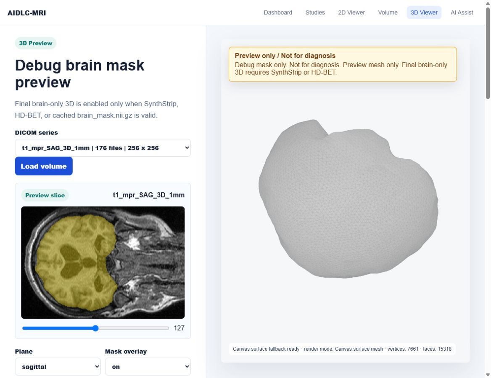

# AIDLC-MRI

Local-first C-MRI 2D/3D viewer for portfolio and research-style visualization.

This project loads local DICOM MRI data, provides a 2D slice viewer, displays brain-mask overlays, and renders a browser-based 3D preview mesh. Final brain-only 3D remains gated behind reliable skull stripping, while fallback/debug masks are clearly labeled as preview-only and not for diagnosis.

> Viewer only. Not for diagnosis. Final medical decisions must follow a clinician's interpretation.

## GitHub About

Suggested repository description:

```text
Local-first C-MRI 2D/3D viewer with DICOM slice preview, brain-mask overlays, and debug/final 3D mesh workflows.
```

Suggested topics:

```text
mri, dicom, medical-imaging, brain-mri, python, pydicom, nifti, trimesh, marching-cubes, threejs, portfolio-project
```

## Screenshot



## Project Summary

AIDLC-MRI is a local-first MRI viewer focused on private brain MRI visualization. It is designed to demonstrate a practical medical-imaging workflow without uploading patient data to an external service.

## Implemented Features

- Load and group local DICOM brain MRI series
- Preview axial, sagittal, and coronal MRI slices
- Load selected DICOM series into a backend 3D volume
- Return 2D slice PNGs from backend MRI slice APIs
- Convert the selected DICOM volume to NIfTI
- Display grayscale slices with brain-mask overlay enabled by default
- Show metadata such as source, shape, spacing, series, mask source, mask ratio, mask unique values, and mask status
- Generate fallback/debug brain masks when reliable tools are unavailable
- Generate preview-only debug 3D meshes from fallback masks with explicit warnings
- Export debug preview meshes to `frontend/static/meshes/debug_brain_preview.glb`
- Render debug preview meshes as solid surface previews in the 3D Viewer
- Keep final 3D mesh generation disabled until a reliable mask is available
- Run reliable skull stripping with HD-BET or SynthStrip when available
- Display binary brain-mask overlays only on `mask == true` pixels
- Render a 3D preview in the browser and show explicit status messages when mesh generation or GLB loading is unavailable or fails

## Experimental / Preview Features

- Debug mask generation from threshold/largest-component fallback logic
- Debug 3D preview mesh for portfolio/demo use only
- Canvas solid-surface fallback when external Three.js modules cannot be loaded
- Atlas/parcellation-based region segmentation with SynthSeg or FastSurfer label maps
- Display region label overlays with separate colors for cerebrum, cerebellum, brainstem, ventricles, hippocampus, basal ganglia, thalamus, white matter, and gray matter
- Generate final brain-only 3D mesh only from `outputs/brain_mask.nii.gz`
- Generate selected-region 3D meshes only from `outputs/regions_labelmap.nii.gz`
- Region volume export and selected-region 3D mesh workflows

## Tech Stack

| Area | Technologies |
| --- | --- |
| Language | Python 3.12, JavaScript, HTML, CSS |
| Local backend | Python `http.server` via `ThreadingHTTPServer` |
| MVP UI | Streamlit |
| Web frontend | Vanilla HTML/CSS/JavaScript |
| DICOM loading | `pydicom` |
| NIfTI I/O | `nibabel` |
| Image processing | `numpy`, `scipy`, `scikit-image` |
| Brain extraction | HD-BET, optional SynthStrip / FreeSurfer |
| Region segmentation | SynthSeg label maps, optional FastSurfer label maps |
| 3D mesh generation | `skimage.measure.marching_cubes`, `trimesh` |
| 3D browser preview | Three.js `GLTFLoader` for GLB surface meshes, with a local canvas surface fallback when external modules are unavailable |
| Legacy/debug mesh plot | Plotly `Mesh3d` remains available through `/api/mesh_plot` |
| Reports / documents | `reportlab` |
| Version control | Git, GitHub |
| OS target | Windows PowerShell local workflow |

## Architecture Overview

```text
Local DICOM data
    -> mri_loader.py
    -> backend/server.py API
    -> frontend/*.html + frontend/static/js
    -> 2D slice preview / mask overlay / 3D preview

Selected DICOM series
    -> outputs/input.nii.gz
    -> HD-BET or SynthStrip
    -> outputs/brain_mask.nii.gz
    -> outputs/brain_only.nii.gz
    -> marching cubes on binary brain mask
    -> outputs/brain_only_mesh.glb
    -> /three-d preview

Debug preview path
    -> fallback/debug brain mask
    -> marching cubes on binary debug mask
    -> frontend/static/meshes/debug_brain_preview.glb
    -> /three-d preview with Preview only / Not for diagnosis warning

Region segmentation
    -> SynthSeg or FastSurfer label map
    -> outputs/regions_labelmap.nii.gz
    -> region volume table / CSV
    -> selected region binary mask
    -> outputs/meshes/{region}.glb
    -> color-coded 2D and 3D region preview
```

The project keeps the local backend and frontend intentionally simple. The main web app is served by `backend/server.py`; the original Streamlit MVP remains available in `app.py`.

## Brain Mask And 3D Pipeline

The 3D pipeline is intentionally conservative:

1. Load selected DICOM series.
2. Save the current volume as `outputs/input.nii.gz`.
3. Try reliable skull stripping with SynthStrip or HD-BET.
4. Save the reliable binary mask as `outputs/brain_mask.nii.gz`.
5. Save `outputs/brain_only.nii.gz` as `original_volume * brain_mask`.
6. Render 2D overlays only where `brain_mask > 0.5`.
7. Build final 3D mesh only from `brain_mask.astype(float)` with `marching_cubes(level=0.5)`.
8. Export final mesh to `outputs/brain_only_mesh.glb`.

Fallback threshold masks are allowed only for debugging and portfolio/demo preview. They are marked as `debug_only` or `invalid_threshold_noise` and can create `frontend/static/meshes/debug_brain_preview.glb` for preview-only rendering. They cannot create final `brain_only_mesh.glb`.

## 3D Viewer Reliability Rules

Final 3D generation is enabled only when:

```python
reliable_mask = (
    mask_source in ["synthstrip", "hd-bet", "cached_brain_mask"]
    and mask_status == "valid"
    and outputs/brain_mask.nii.gz exists
)
```

If this condition is false, final 3D generation remains disabled. The 3D Viewer can still generate a clearly labeled debug preview mesh when a fallback/debug mask exists:

- `No mesh generated yet`
- `Preview mesh not generated yet. Click Generate Preview 3D.`
- `Debug brain mask detected. Preview 3D mesh can be generated, but final medical brain-only 3D is disabled.`
- `Building 3D mesh...`
- `GLB surface mesh ready`
- `Canvas surface fallback ready`
- `GLB load failed`
- `Mesh generation failed: {error}`

This prevents threshold noise, skull/scalp/neck tissue, ellipse ROI masks, or unknown cached masks from being presented as final brain-only 3D results. Debug preview meshes are always labeled `Preview only` and `Not for diagnosis`.

## Region Segmentation / Parcellation

Brain extraction and region segmentation are separate stages:

- HD-BET/SynthStrip: whole-brain extraction and skull stripping
- SynthSeg/FastSurfer: atlas/parcellation-based region label map generation

The app never uses threshold, ellipse, or intensity fallback logic to split the brain into cerebrum, cerebellum, brainstem, hippocampus, ventricles, or basal ganglia. Region segmentation is enabled only when a valid label map exists:

```text
outputs/regions_labelmap.nii.gz
```

Supported region groups:

- Cerebrum
- Cerebellum
- Brainstem
- Ventricle
- Hippocampus
- Basal Ganglia
- Thalamus
- White Matter
- Gray Matter

Target/tumor regions are not generated automatically. A target or tumor overlay requires a separate tumor segmentation model or manual mask saved as:

```text
outputs/target_mask.nii.gz
```

Region workflow:

1. Load volume.
2. Run brain extraction.
3. Run region segmentation.
4. Load `outputs/regions_labelmap.nii.gz`.
5. Select a region in the UI.
6. Show selected-region or all-region 2D overlay.
7. Build selected region 3D mesh.
8. Export `outputs/region_volumes.csv`.

Generated region outputs:

```text
outputs/regions_labelmap.nii.gz
outputs/region_volumes.csv
outputs/meshes/cerebrum.glb
outputs/meshes/cerebellum.glb
outputs/meshes/brainstem.glb
outputs/meshes/ventricle.glb
outputs/meshes/hippocampus.glb
outputs/meshes/basal_ganglia.glb
```

If SynthSeg/FastSurfer is unavailable and no label map exists, the UI shows:

```text
Region segmentation requires SynthSeg or FastSurfer. Threshold-based region segmentation is disabled.
```

## Current Data Path

The default local data folder is:

```text
C:\Users\user\Desktop\mri2\mri-project-main\data
```

The app scans this folder recursively and groups DICOM files by series.

## Main Screens

- Dashboard: project overview and quick links
- Studies: DICOM series list grouped into study-style rows
- 2D Viewer: grayscale MRI slice viewer with plane and slice controls
- Volume: mock longitudinal volume tracking plus current brain-mask volume summary
- 3D Viewer: brain mesh preview based on available brain mask
- AI Assist: skull-stripping, mask, mesh, and overlay status summary

## Local Web App

Run the backend/frontend server:

```powershell
.\.venv\Scripts\python.exe run_backend_frontend.py
```

Open:

```text
http://127.0.0.1:8000
```

Useful pages:

```text
http://127.0.0.1:8000/studies
http://127.0.0.1:8000/viewer
http://127.0.0.1:8000/volume
http://127.0.0.1:8000/three-d
http://127.0.0.1:8000/ai
```

See [COMMANDS.md](COMMANDS.md) for a compact command reference.

## Streamlit App

The original Streamlit MVP is still available:

```powershell
.\.venv\Scripts\streamlit.exe run app.py --server.port 8501
```

Open:

```text
http://127.0.0.1:8501
```

## Install Dependencies

```powershell
.\.venv\Scripts\python.exe -m pip install -r requirements.txt
```

Optional brain extraction tools:

- HD-BET
- SynthStrip / FreeSurfer

See [INSTALL.md](INSTALL.md) for HD-BET and SynthStrip notes.

HD-BET can be installed into the project virtualenv:

```powershell
.\.venv\Scripts\python.exe -m pip install hd-bet
```

The local web app checks HD-BET with:

```powershell
.\.venv\Scripts\python.exe -c "import HD_BET; print('HD_BET installed')"
```

## Backend API

The local web frontend uses these endpoints:

- `GET /health`
- `GET /api/project-summary`
- `GET /api/status`
- `GET /api/series`
- `GET /api/studies`
- `GET /api/load`
- `GET /api/slice`
- `GET /api/mri/metadata`
- `GET /api/mri/slice`
- `GET /api/mri/slice/{plane}`
- `GET /api/slice-info`
- `GET /api/mask`
- `GET /api/rebuild_mask`
- `GET /api/clear_outputs`
- `GET /api/run_hdbet`
- `GET /api/mesh`
- `GET /api/mesh_plot`
- `GET /api/mri/mesh/debug-preview`
- `POST /api/mri/mesh/debug-preview`
- `GET /api/mri/mesh/debug-preview/status`
- `GET /api/threejs_viewer`
- `GET /api/mesh-status`
- `GET /api/tracking`
- `GET /api/volume-result`
- `GET /api/ai-results`

## MRI Processing Notes

- DICOM series are sorted by `InstanceNumber`.
- Pixel data is loaded through `pydicom.pixel_array`.
- Orientation is inferred from DICOM metadata and series description.
- 2D display uses grayscale windowed slice rendering.
- ROI area uses `PixelSpacing`.
- ROI/brain volume calculations use slice spacing or slice thickness when available.

## Brain-Only 3D Policy

Final brain-only 3D mesh generation should use a reliable skull-stripping result:

- SynthStrip mask
- HD-BET mask

Simple threshold fallback is debug-only. It must not be treated as final brain-only 3D output.

The app treats a mask as reliable only when all of these are true:

- `mask_source` is `synthstrip`, `hd-bet`, or `cached_brain_mask`
- `mask_status` is `valid`
- `outputs/brain_mask.nii.gz` exists
- `reliable_mask` is `true`

Fallback threshold, cached unknown, ellipse/ROI/debug masks are always unreliable. If a reliable mask is not available, final 3D generation returns:

```json
{
  "ok": false,
  "status": "debug_only",
  "message": "SynthStrip or HD-BET brain mask is required for final 3D brain mesh.",
  "mesh_path": null
}
```

Final 3D mesh generation runs marching cubes only on `outputs/brain_mask.nii.gz`. It does not run marching cubes on the original MRI intensity volume or threshold fallback mask.

## HD-BET Workflow

On the 3D Viewer page:

```text
http://127.0.0.1:8000/three-d
```

Use these buttons:

- `Load volume`: load the selected DICOM series.
- `Clear outputs`: remove generated masks, meshes, NIfTI files, and overlay PNGs from `outputs/`.
- `Rebuild mask`: clear mask/mesh cache and reset mask state.
- `Run HD-BET`: convert the current DICOM series to `outputs/input.nii.gz`, run HD-BET, and save `outputs/brain_mask.nii.gz`.
- `Build final 3D mesh`: create `outputs/brain_only_mesh.glb` only when the HD-BET/SynthStrip mask is reliable.

The app first tries the requested command style:

```powershell
python -m HD_BET.run -i outputs/input.nii.gz -o outputs/brain_only.nii.gz -device cpu -mode fast
```

For installed `hd-bet` versions that expose `HD_BET.entry_point` instead of `HD_BET.run`, it falls back to:

```powershell
python -m HD_BET.entry_point -i outputs/input.nii.gz -o outputs/brain_only.nii.gz -device cpu --disable_tta --save_bet_mask
```

The app then searches HD-BET mask outputs such as:

```text
outputs/brain_only_mask.nii.gz
outputs/brain_only_bet.nii.gz
outputs/input_mask.nii.gz
outputs/input_bet.nii.gz
outputs/*mask*.nii.gz
outputs/*_mask.nii.gz
outputs/*_bet.nii.gz
```

When a valid HD-BET mask is found, it is copied/saved as:

```text
outputs/brain_mask.nii.gz
```

The preview overlay is then drawn from this binary mask only.

## Output Files

Common generated outputs:

```text
outputs/brain_mask.nii.gz
outputs/brain_mask_source.json
outputs/input.nii.gz
outputs/brain_only.nii.gz
outputs/brain_only_bet.nii.gz
outputs/brain_only_mesh.glb
outputs/brain_overlay.png
outputs/brain_overlay_axial.png
outputs/brain_overlay_sagittal.png
outputs/brain_overlay_coronal.png
```

Availability depends on the selected processing path and installed skull-stripping tools.

Debug-only fallback outputs may include:

```text
outputs/fallback_preview_mask.nii.gz
outputs/debug_mask_mesh.glb
outputs/debug_mask_overlay.png
outputs/debug_mask_overlay_axial.png
outputs/debug_mask_overlay_sagittal.png
outputs/debug_mask_overlay_coronal.png
frontend/static/meshes/debug_brain_preview.glb
frontend/static/meshes/debug_brain_preview.json
```

These debug outputs are not final brain extraction results.

## Repository Structure

```text
app.py                    Streamlit MVP
backend/server.py         Local backend/frontend HTTP server
backend_server.py         Compatibility wrapper for older run commands
run_backend_frontend.py   Starts the local web app server
mri_loader.py             DICOM/NIfTI loading
preprocessing.py          Normalization and slice helpers
brain_mask.py             Fallback mask/refinement logic
skull_stripping.py        SynthStrip/HD-BET integration helpers
mesh_builder.py           Marching cubes and mesh export
report.py                 PDF report helpers
frontend/                 Dashboard, viewer, 3D, studies, volume, AI pages
docs/screenshots/         README screenshots
utils/                    DICOM helper loader
outputs/                  Generated masks and meshes
```

## Verification

Recent local verification:

- `/studies` loads DICOM series rows.
- `/volume` renders T01 to T14 mock tracking rows.
- `/ai` renders mask/mesh readiness checks.
- `/viewer` loads backend PNG slices and shows brain-mask overlay by default.
- `/api/mri/metadata` returns volume shape and spacing.
- `/api/mri/slice?plane=sagittal&overlay=true` returns `image/png`.
- `/api/mri/mesh/debug-preview` generates `frontend/static/meshes/debug_brain_preview.glb`.
- `/static/meshes/debug_brain_preview.glb` returns `200` with `Content-Type: model/gltf-binary`.
- `/three-d` shows the masked slice preview and a solid debug 3D surface preview.
- Final 3D remains disabled unless `reliable_mask=true`.
- Threshold fallback remains `invalid_threshold_noise` / debug-only and cannot create final medical brain-only 3D output.

## Docker

```powershell
docker build -t brain-mri-viewer .
docker run --rm -p 8501:8501 brain-mri-viewer
```

With local data mounted:

```powershell
docker run --rm -p 8501:8501 -v C:\Users\user\Desktop\mri2\mri-project-main\data:/data -e MRI_DATA_DIR=/data brain-mri-viewer
```

## Medical Disclaimer

This is not a diagnostic medical device.

It is a portfolio/MVP viewer for visual confirmation, research-style demonstration, and local MRI data exploration. It does not replace clinical interpretation, radiology workflow, or physician review.
