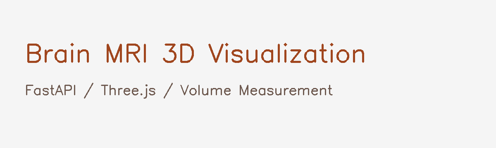

# mri-project
# Brain MRI 3D Visualization & Volume Measurement Web Service

<p align="center">
  
</p>

<h2 align="center">Brain MRI 기반 3D 병변 시각화 및 부피 계산 웹서비스</h2>

<p align="center">
  FastAPI · Three.js · Medical Image Processing · 3D Visualization · Volume Measurement
</p>

<p align="center">
  
  
  
  
  
</p>

---

## 프로젝트 소개

본 프로젝트는 Brain MRI 데이터를 기반으로 병변 또는 종양 의심 영역을 3D로 시각화하고, segmentation mask를 활용하여 부피를 cm³ 단위로 계산하는 연구용 웹 프로토타입입니다.

MRI 원본 데이터를 의료 진단에 직접 사용하는 것이 아니라, DICOM/NIfTI 기반 의료영상 데이터를 웹서비스에서 조회 가능한 형태로 변환하고, 2D 슬라이스 뷰어, 3D 모델 뷰어, 부피 계산 결과, 시점별 변화 추적 기능을 제공하는 것을 목표로 합니다.

본 시스템은 의료진의 진단을 대체하지 않으며, 의료영상 분석 흐름을 이해하고 구현하기 위한 포트폴리오용 연구 프로젝트입니다.

---

## 핵심 목표

```txt
Brain MRI CD/DICOM 데이터 정리
→ NIfTI 변환
→ 2D 슬라이스 확인
→ segmentation mask 기반 부피 계산
→ 3D mesh 모델 생성
→ PC/모바일 웹에서 3D 확인
→ 시점별 부피 변화 추적
```

---

## 주요 기능

| 기능            | 설명                                      |
| ------------- | --------------------------------------- |
| MRI 데이터 목록 관리 | T01~T12와 같은 비식별 시점 라벨로 MRI 데이터를 관리      |
| 2D 슬라이스 뷰어    | MRI 슬라이스 및 preview 이미지를 웹에서 확인          |
| Mask Overlay  | 병변 또는 종양 의심 영역의 mask overlay 확인         |
| 부피 계산         | voxel 개수와 spacing 정보를 기반으로 cm³ 단위 부피 계산 |
| 3D 모델 생성      | segmentation mask를 3D mesh 모델로 변환       |
| PC/모바일 3D 뷰어  | Three.js 기반 3D 모델 회전, 확대, 축소 지원         |
| 시점별 추적        | MRI 시점별 부피 변화량과 변화율 확인                  |
| 데이터 보호 구조     | 원본 MRI는 외부 저장소에 업로드하지 않고 원격 PC에 보관      |

---

## 데이터 분류 예시

본 프로젝트는 실제 병원명, 촬영일, 환자번호를 공개하지 않고 비식별 라벨을 사용합니다.

| 시점        | 구간                     | 설명                   |
| --------- | ---------------------- | -------------------- |
| T01 ~ T04 | surgery_follow_up      | 외과적 수술 관련 MRI 추적 구간  |
| T04 ~ T05 | hospital_transition    | 병원 또는 촬영 장비 변경 구간    |
| T05 ~ T07 | chemo_period_estimated | 항암제 치료 시점 인접 구간      |
| T08 이후    | gamma_knife_follow_up  | 감마나이프 수술 이후 장기 추적 구간 |
| T09 ~ T12 | stable_follow_up       | 큰 변화가 없는 안정 추적 예상 구간 |

> T04~T05 구간은 병원 또는 장비 변경 가능성이 있으므로 직접적인 치료 효과 판단 구간으로 사용하지 않습니다.

---

## 시스템 구조

```txt
사용자 PC / 모바일 브라우저
        ↓
FastAPI Web Server
        ↓
원격 PC 기반 분석 환경
        ├─ 원본 MRI CD/DICOM 보관
        ├─ DICOM/NIfTI 변환
        ├─ 슬라이스 이미지 생성
        ├─ segmentation mask 관리
        ├─ voxel 기반 부피 계산
        ├─ 3D mesh 모델 생성
        └─ 분석 결과 JSON 저장
```

---

## 웹 화면 구성

| 페이지        | 설명             |
| ---------- | -------------- |
| `/`        | 프로젝트 소개 및 대시보드 |
| `/studies` | MRI 시점 목록      |
| `/viewer`  | 2D MRI 슬라이스 뷰어 |
| `/volume`  | 부피 계산 결과       |
| `/three-d` | 3D 병변 모델 뷰어    |

---

## PC / 모바일 지원 구조

본 프로젝트는 PC와 모바일 브라우저에서 모두 접근 가능한 반응형 웹 구조를 목표로 합니다.

### PC 화면

```txt
MRI 목록
2D 슬라이스 뷰어
부피 계산 결과
3D 모델 뷰어
시점별 추적 그래프
```

### 모바일 화면

```txt
3D 모델 확인
부피 cm³ 확인
변화량 / 변화율 확인
터치 기반 회전 / 확대 / 축소
```

---

## 기술 스택

### Backend

| 기술         | 사용 목적                    |
| ---------- | ------------------------ |
| Python     | 의료영상 처리 및 서버 구현          |
| FastAPI    | REST API 및 웹 서버          |
| SQLite     | 비식별 MRI 메타데이터 및 분석 결과 저장 |
| SQLAlchemy | DB 모델 관리                 |

### Medical Image Processing

| 기술           | 사용 목적                        |
| ------------ | ---------------------------- |
| pydicom      | DICOM 파일 읽기                  |
| nibabel      | NIfTI 파일 처리                  |
| SimpleITK    | 의료영상 전처리                     |
| NumPy        | voxel 계산                     |
| OpenCV       | 슬라이스 이미지 변환                  |
| scikit-image | marching cubes 기반 3D mesh 생성 |
| trimesh      | 3D mesh 저장 및 변환              |

### Frontend

| 기술                  | 사용 목적        |
| ------------------- | ------------ |
| HTML/CSS/JavaScript | 반응형 웹 화면     |
| Three.js            | 3D 모델 웹 시각화  |
| GLTFLoader          | GLB 3D 모델 로딩 |

---

## 폴더 구조

```txt
mri-3d-web/
├─ backend/
│  ├─ main.py
│  ├─ database.py
│  ├─ models.py
│  └─ routers/
│     ├─ studies.py
│     ├─ analysis.py
│     └─ tracking.py
│
├─ frontend/
│  ├─ index.html
│  ├─ studies.html
│  ├─ viewer.html
│  ├─ volume.html
│  ├─ three_d.html
│  └─ static/
│     ├─ css/
│     │  └─ style.css
│     └─ js/
│        ├─ studies.js
│        ├─ viewer.js
│        ├─ volume.js
│        └─ three_viewer.js
│
├─ media/
│  ├─ slices/
│  ├─ overlays/
│  ├─ models/
│  └─ reports/
│
├─ sample_data/
│  ├─ metadata_sample.csv
│  ├─ tracking_sample.csv
│  └─ result_sample.json
│
├─ assets/
│  └─ mri-banner.png
│
├─ requirements.txt
├─ README.md
└─ .gitignore
```

---

## 분석 결과 JSON 예시

```json
{
  "patient_code": "P001",
  "study_label": "T08",
  "event_type": "post_gamma_knife_follow_up",
  "volume_cm3": 39.4,
  "change_cm3": -2.6,
  "change_rate_percent": -6.19,
  "model_3d_url": "/media/models/P001/T08/lesion_model.glb",
  "preview_url": "/media/slices/P001/T08/preview_slice.png",
  "overlay_url": "/media/overlays/P001/T08/overlay.png",
  "notice": "본 결과는 의료진 진단을 대체하지 않는 연구용 분석 보조 결과입니다."
}
```

---

## 실행 방법

### 1. 가상환경 생성

```bash
python -m venv .venv
.venv\Scripts\activate
```

### 2. 패키지 설치

```bash
pip install -r requirements.txt
```

### 3. 서버 실행

```bash
uvicorn backend.main:app --host 0.0.0.0 --port 8000 --reload
```

### 4. PC에서 접속

```txt
http://127.0.0.1:8000
```

### 5. 같은 와이파이 모바일에서 접속

원격 PC의 IP를 확인합니다.

```bash
ipconfig
```

예시:

```txt
http://192.168.0.15:8000
```

3D 뷰어:

```txt
http://192.168.0.15:8000/three-d
```

---

## 데이터 보호 정책

본 프로젝트는 개인 의료영상 데이터를 다루는 구조를 고려하여 다음 원칙을 적용합니다.

* 원본 DICOM/MRI 파일은 GitHub에 업로드하지 않음
* 실제 환자번호, 이름, 생년월일, 촬영일, 병원명은 공개하지 않음
* MRI 시점은 `T01`, `T02`와 같은 비식별 라벨로 관리
* 병원 정보는 `HOSP_A`, `HOSP_B`와 같은 가명으로 관리
* 원본 파일은 로컬 또는 원격 PC의 private 폴더에만 보관
* 외부 공개용 저장소에는 코드, 샘플 메타데이터, 샘플 결과 JSON만 포함
* 분석 결과는 의료적 진단이 아닌 연구용 분석 보조 결과로 표시

---

## `.gitignore` 정책

원본 MRI와 분석 결과 파일은 GitHub에 올리지 않습니다.

```gitignore
.venv/
__pycache__/
*.pyc

# DB
*.db
db/

# private MRI data
mri_data/
raw_private/
encrypted/
decrypted_test/

# medical image files
*.dcm
*.nii
*.nii.gz
*.npy
*.npz

# generated media
media/uploads/
media/processed/
media/slices/
media/overlays/
media/masks/
media/models/
media/reports/

# encrypted files
*.enc

# OS
.DS_Store
Thumbs.db
```

---

## 구현 범위

### 포함 범위

* MRI CD/DICOM 데이터 관리 구조 설계
* DICOM/NIfTI 기반 분석 구조
* 2D 슬라이스 확인
* segmentation mask 기반 부피 계산
* 3D 모델 생성 및 웹 뷰어
* PC/모바일 반응형 화면
* 시점별 부피 변화 추적
* 원본 의료영상 비공개 구조

### 제외 범위

* 의료 진단 자동화
* 암 확정 판정
* 치료 효과 확정
* 완치 또는 재발 여부 판단
* PACS/EMR 직접 연동
* 의료기기 인허가 수준 검증

---

## 포트폴리오 포인트

본 프로젝트는 단순 웹 CRUD 프로젝트가 아니라, 의료영상 데이터 처리와 웹서비스 구현을 연결한 프로젝트입니다.

강조할 수 있는 경험은 다음과 같습니다.

```txt
대용량 Brain MRI 데이터 구조 설계
DICOM/NIfTI 기반 의료영상 처리 흐름 이해
voxel spacing 기반 부피 계산 로직 설계
segmentation mask 기반 3D 모델 생성
Three.js 기반 PC/모바일 3D 뷰어 구현
FastAPI 기반 분석 결과 API 제공
민감 의료영상 데이터 보호 구조 설계
```

---

## 주의사항

본 프로젝트는 연구용 및 포트폴리오용 프로토타입입니다.

본 시스템의 분석 결과는 의료진의 진단을 대체하지 않으며, 실제 진단, 치료 효과 판정, 완치 또는 재발 여부 판단에 사용할 수 없습니다.

원본 MRI 파일과 개인 의료정보는 공개 저장소에 포함하지 않습니다.
