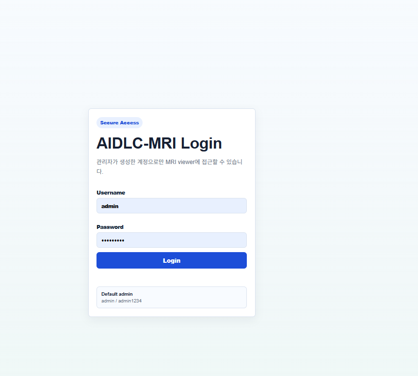
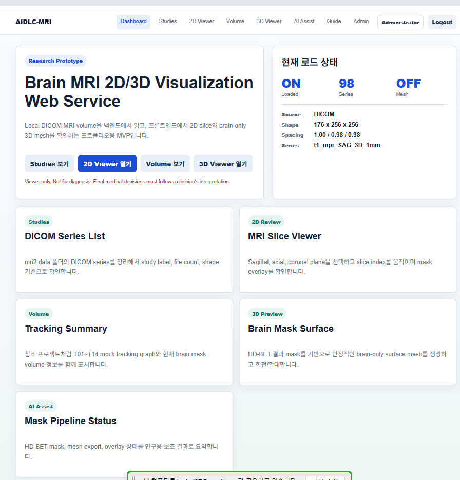
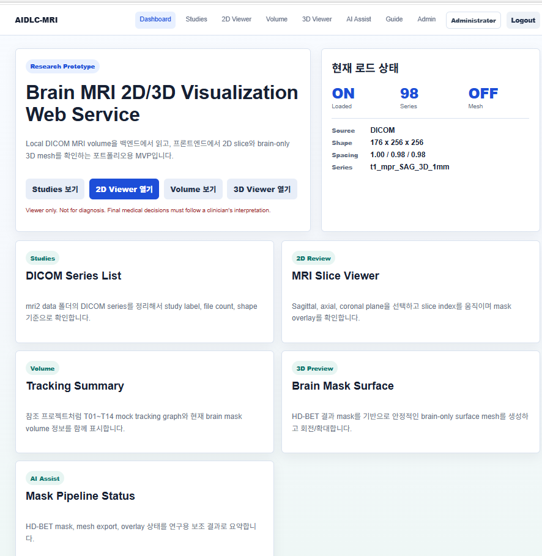
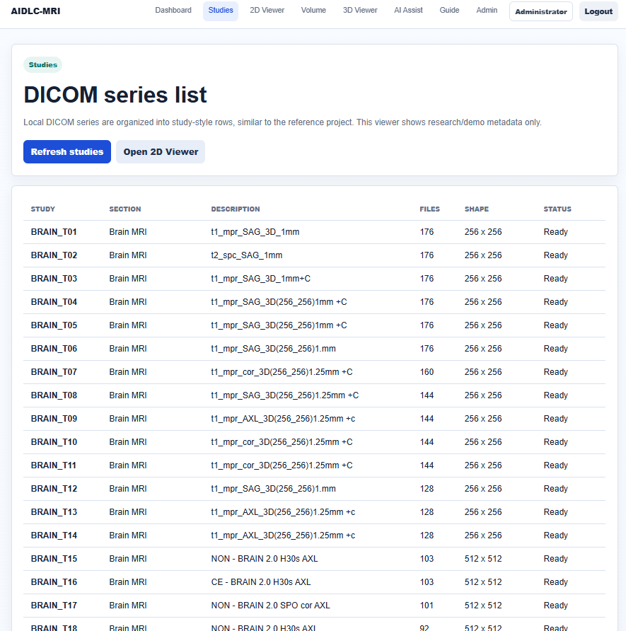
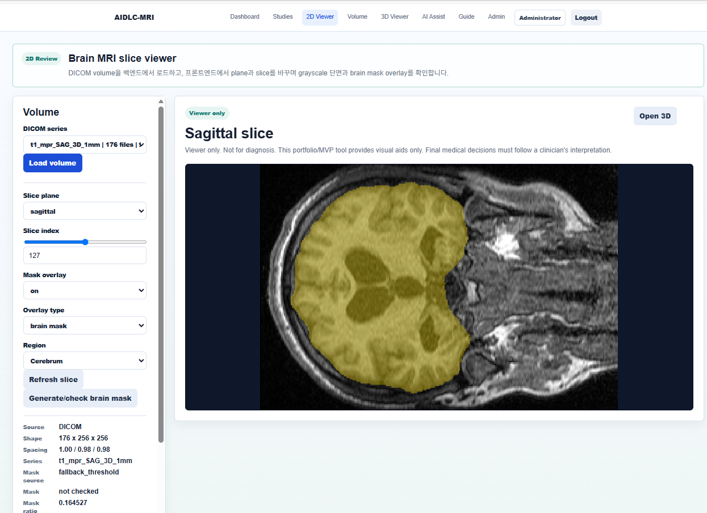
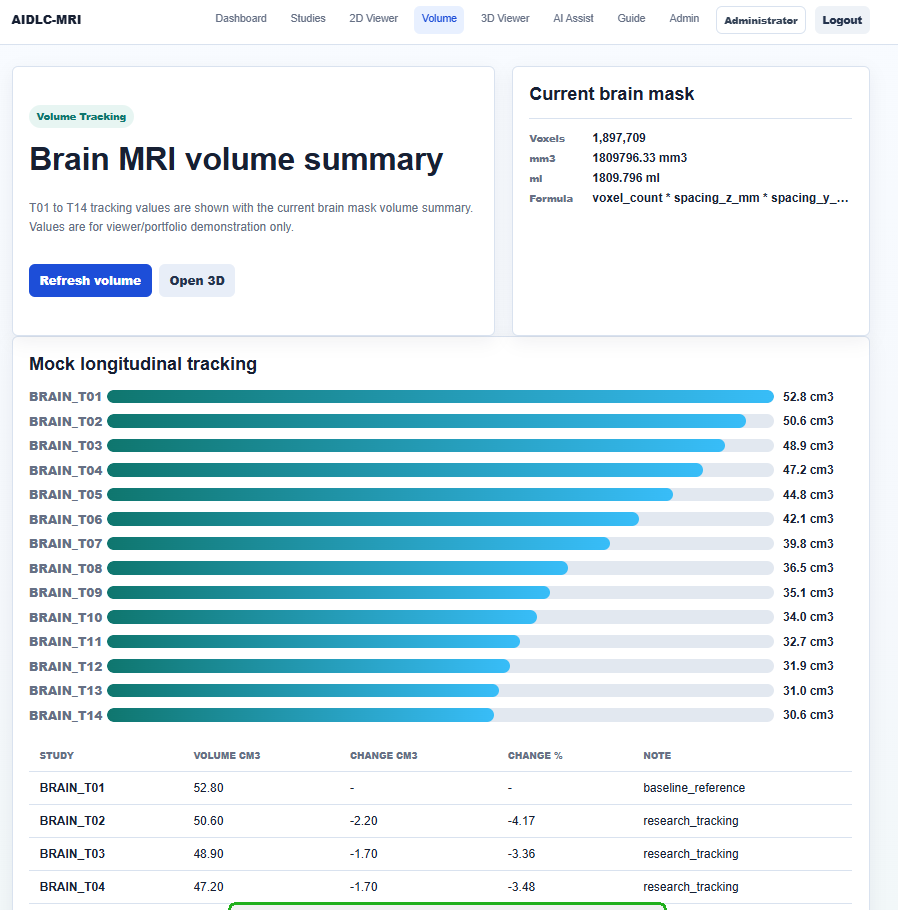
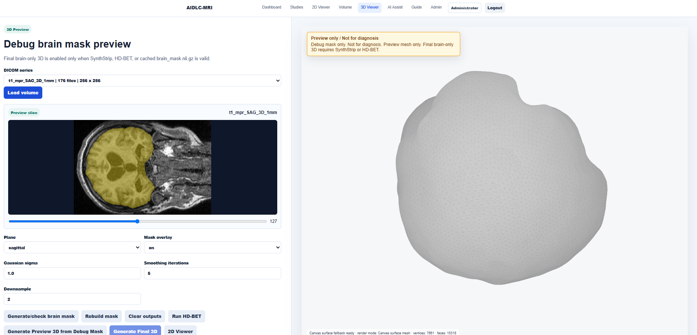
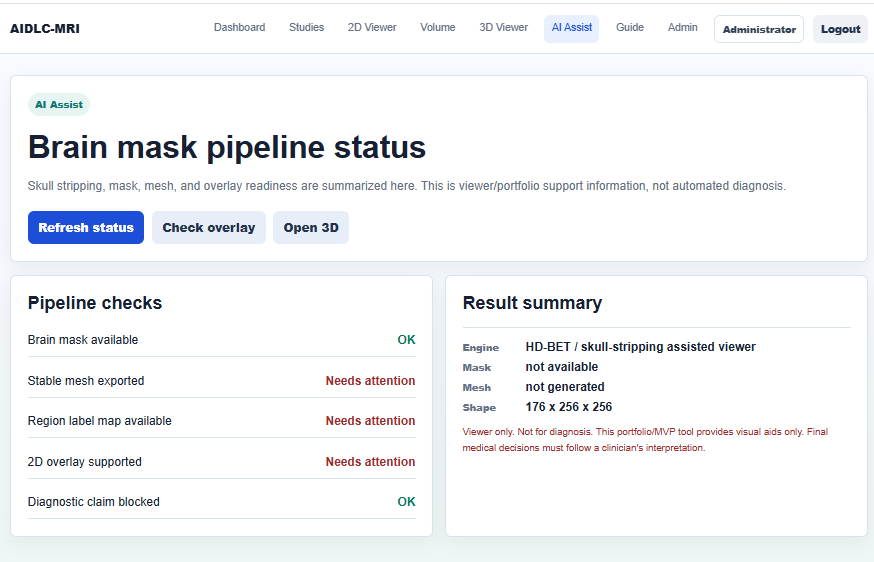
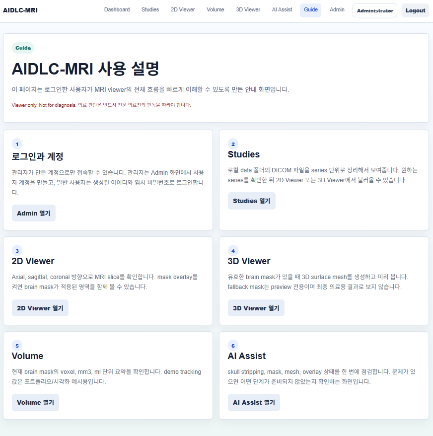
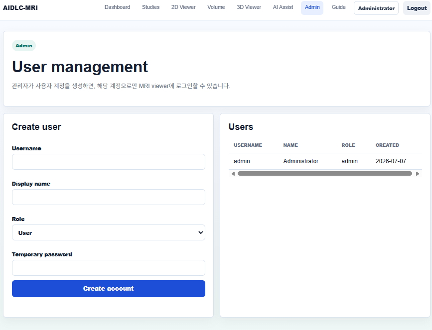

# Brain MRI 3D Visualization & Volume Measurement Web Service

## Screen Preview

### Login



### Dashboard





### Studies



### 2D Viewer



### Volume



### 3D Viewer



### AI Assist



### Guide



### Admin



## 1. 프로젝트 개요

본 프로젝트는 Brain MRI 데이터를 기반으로 병변 또는 종양 의심 영역을 3D로 시각화하고, segmentation mask를 활용하여 부피를 cm³ 단위로 계산하는 연구용 웹 프로토타입입니다.

MRI 원본 데이터를 의료 진단에 직접 사용하는 것이 아니라, DICOM/NIfTI 기반 의료영상 데이터를 웹서비스에서 조회 가능한 형태로 변환하고, 2D 슬라이스 뷰어, 3D 모델 뷰어, 부피 계산 결과, 시점별 변화 추적 기능을 제공하는 것을 목표로 합니다.

본 시스템은 의료진의 진단을 대체하지 않으며, 의료영상 분석 흐름을 이해하고 구현하기 위한 포트폴리오용 연구 프로젝트입니다.

---

## 2. 프로젝트 목표

본 프로젝트의 핵심 목표는 다음과 같습니다.

* Brain MRI CD/DICOM 데이터를 분석 가능한 구조로 정리
* MRI 데이터를 NIfTI 또는 내부 분석 포맷으로 변환
* MRI 슬라이스를 웹에서 확인할 수 있는 2D 뷰어 구현
* 병변 또는 종양 의심 영역의 segmentation mask 기반 부피 계산
* mask 데이터를 3D mesh 모델로 변환
* PC 및 모바일 브라우저에서 3D 모델 확인
* 시점별 MRI 부피 변화량 및 변화율 확인
* 민감 의료영상 데이터 보호를 고려한 원격 PC 기반 분석 구조 설계

---

## 3. 주요 기능

### 3.1 MRI 데이터 목록 관리

MRI 촬영 시점을 `T01 ~ T12`와 같은 비식별 라벨로 관리합니다.
실제 환자번호, 병원명, 촬영일은 공개 저장소에 포함하지 않습니다.

예시 분류:

| 구간        | 의미                              |
| --------- | ------------------------------- |
| T01 ~ T04 | 외과적 수술 관련 MRI 추적 구간             |
| T04 ~ T05 | 병원 또는 장비 변경 구간                  |
| T05 ~ T07 | 항암제 치료 시점 인접 구간                 |
| T08 이후    | 감마나이프 수술 이후 장기 추적 구간            |
| T09 ~ T12 | 큰 변화가 없는 stable follow-up 예상 구간 |

단, 모든 치료 이벤트 정보는 의료적 판정이 아니라 데이터 분류를 위한 참고 라벨로만 사용합니다.

---

### 3.2 2D MRI 슬라이스 뷰어

MRI 데이터를 슬라이스 단위로 확인할 수 있는 웹 기반 2D 뷰어를 제공합니다.

* MRI 대표 슬라이스 확인
* preview image 표시
* mask overlay image 표시
* PC 브라우저 기반 확인
* 추후 모바일 대응 가능

---

### 3.3 병변 부피 계산

segmentation mask를 기준으로 병변 또는 종양 의심 영역의 부피를 계산합니다.

계산 방식:

```txt
volume_cm3 = mask_voxel_count × spacing_x × spacing_y × spacing_z / 1000
```

여기서 spacing 값은 MRI voxel의 실제 크기(mm)를 의미합니다.
계산 결과는 cm³ 단위로 표시합니다.

---

### 3.4 3D 모델 생성 및 웹 뷰어

mask 데이터를 기반으로 marching cubes 알고리즘을 적용하여 3D mesh 모델을 생성합니다.

생성된 모델은 웹과 모바일 브라우저에서 확인할 수 있도록 `.glb` 형식으로 제공하는 것을 목표로 합니다.

지원 목표:

* 3D 모델 회전
* 확대/축소
* 모바일 터치 조작
* 부피 결과 동시 표시
* 시점별 3D 모델 선택

---

### 3.5 시점별 변화 추적

여러 MRI 시점의 부피 결과를 비교하여 변화량과 변화율을 계산합니다.

예시:

| 시점  | 구간                         | 부피(cm³) |   변화량 |    변화율 |
| --- | -------------------------- | ------: | ----: | -----: |
| T01 | surgery_follow_up          |    42.3 |     - |      - |
| T04 | surgery_follow_up          |    41.8 |  -0.5 | -1.18% |
| T05 | hospital_transition        |    42.0 | 비교 주의 |  비교 주의 |
| T08 | post_gamma_knife_follow_up |    39.4 |  -2.6 | -6.19% |
| T12 | recent_follow_up           |    38.9 |  -0.5 | -1.27% |

T04~T05 구간은 병원 또는 장비 변경 가능성이 있으므로 직접적인 치료 효과 판단 구간으로 사용하지 않습니다.

---

## 4. 시스템 구조

본 프로젝트는 원본 의료영상 데이터를 외부 서버에 업로드하지 않고, 원격 PC를 분석 서버로 활용하는 구조를 기준으로 설계했습니다.

```txt
사용자 PC / 모바일
        ↓
FastAPI Web Server
        ↓
원격 PC 기반 분석 환경
        ├─ 원본 MRI CD/DICOM 보관
        ├─ NIfTI 변환
        ├─ 슬라이스 이미지 생성
        ├─ segmentation mask 관리
        ├─ 부피 계산
        ├─ 3D mesh 모델 생성
        └─ 분석 결과 JSON 저장
```

GitHub에는 코드와 샘플 메타데이터만 공개하며, 원본 MRI 파일은 포함하지 않습니다.

---

## 5. 폴더 구조

```txt
mri-3d-web/
├─ backend/
│  ├─ main.py
│  ├─ database.py
│  ├─ models.py
│  └─ routers/
│     ├─ studies.py
│     ├─ analysis.py
│     └─ tracking.py
│
├─ frontend/
│  ├─ index.html
│  ├─ studies.html
│  ├─ viewer.html
│  ├─ volume.html
│  ├─ three_d.html
│  └─ static/
│     ├─ css/
│     │  └─ style.css
│     └─ js/
│        ├─ api.js
│        ├─ studies.js
│        ├─ viewer.js
│        ├─ volume.js
│        └─ three_viewer.js
│
├─ media/
│  ├─ slices/
│  ├─ overlays/
│  ├─ models/
│  └─ reports/
│
├─ sample_data/
│  ├─ metadata_sample.csv
│  ├─ tracking_sample.csv
│  └─ result_sample.json
│
├─ db/
│  └─ mri_analysis.db
│
├─ requirements.txt
├─ README.md
└─ .gitignore
```

---

## 6. 원본 MRI 데이터 보관 구조

원본 MRI CD/DICOM 파일은 GitHub에 업로드하지 않고, 로컬 또는 원격 PC의 private 경로에만 보관합니다.

예시:

```txt
C:\mri_data\
├─ raw_private\
│  ├─ T01_cd_original
│  ├─ T02_cd_original
│  ├─ T03_cd_original
│  └─ ...
│
├─ encrypted\
├─ nifti\
├─ slices\
├─ masks\
├─ models\
├─ reports\
└─ db\
```

각 CD 원본은 그대로 보존하고, 분석용 데이터는 NIfTI, PNG, mask, GLB, JSON 형태로 별도 생성합니다.

---

## 7. 데이터 보호 정책

본 프로젝트는 개인 의료영상 데이터를 다루는 구조를 고려하여 다음 원칙을 적용합니다.

* 원본 DICOM/MRI 파일은 GitHub에 업로드하지 않음
* 실제 환자번호, 이름, 생년월일, 촬영일, 병원명은 공개하지 않음
* MRI 시점은 `T01`, `T02`와 같은 비식별 라벨로 관리
* 병원 정보는 `HOSP_A`, `HOSP_B`와 같은 가명으로 관리
* 원본 파일은 로컬 또는 원격 PC의 private 폴더에만 보관
* 외부 공개용 저장소에는 코드, 샘플 메타데이터, 샘플 결과 JSON만 포함
* 분석 결과는 의료적 진단이 아닌 연구용 분석 보조 결과로 표시

---

## 8. 데이터베이스 설계 방향

MRI 원본 파일 자체는 DB에 저장하지 않습니다.
DB에는 파일 경로, 비식별 메타데이터, 분석 결과만 저장합니다.

저장 대상:

* patient_code
* study_label
* study_order
* hospital_group
* event_type
* raw_path
* nifti_path
* slice_dir
* mask_path
* model_3d_path
* volume_cm3
* analysis_status
* created_at

저장하지 않는 정보:

* 실제 환자번호
* 실제 이름
* 실제 촬영일
* 주민등록번호
* 원본 DICOM 파일 자체
* 암호 또는 비밀번호

---

## 9. 기술 스택

### Backend

* Python
* FastAPI
* SQLite
* SQLAlchemy
* Pydantic

### Medical Image Processing

* pydicom
* nibabel
* SimpleITK
* NumPy
* OpenCV
* scikit-image
* trimesh

### Frontend

* HTML
* CSS
* JavaScript
* Three.js
* GLTFLoader
* 반응형 웹 구조

### Security / Data Handling

* cryptography
* local encrypted backup
* `.gitignore` 기반 민감 파일 제외

---

## 10. 실행 방법

### 10.1 가상환경 생성

```bash
python -m venv .venv
.venv\Scripts\activate
```

### 10.2 패키지 설치

```bash
pip install -r requirements.txt
```

### 10.3 서버 실행

```bash
uvicorn backend.main:app --host 0.0.0.0 --port 8000 --reload
```

### 10.4 PC에서 접속

```txt
http://127.0.0.1:8000
```

### 10.5 같은 와이파이 모바일에서 접속

원격 PC의 IP 확인:

```bash
ipconfig
```

예시:

```txt
http://192.168.0.15:8000
```

3D 뷰어 접속:

```txt
http://192.168.0.15:8000/three-d
```

---

## 11. 주요 화면

| 페이지        | 설명             |
| ---------- | -------------- |
| `/`        | 프로젝트 소개 및 대시보드 |
| `/studies` | MRI 시점 목록      |
| `/viewer`  | 2D MRI 슬라이스 뷰어 |
| `/volume`  | 부피 계산 결과       |
| `/three-d` | 3D 병변 모델 뷰어    |

---

## 12. API 예시

### MRI 목록 조회

```txt
GET /api/studies
```

### 분석 결과 조회

```txt
GET /api/analysis/{study_label}
```

예시:

```txt
GET /api/analysis/T08
```

### 시점별 추적 결과 조회

```txt
GET /api/tracking/P001
```

---

## 13. 분석 결과 JSON 예시

```json
{
  "patient_code": "P001",
  "study_label": "T08",
  "event_type": "post_gamma_knife_follow_up",
  "volume_cm3": 39.4,
  "change_cm3": -2.6,
  "change_rate_percent": -6.19,
  "model_3d_url": "/media/models/P001/T08/lesion_model.glb",
  "preview_url": "/media/slices/P001/T08/preview_slice.png",
  "overlay_url": "/media/overlays/P001/T08/overlay.png",
  "notice": "본 결과는 의료진 진단을 대체하지 않는 연구용 분석 보조 결과입니다."
}
```

---

## 14. `.gitignore` 정책

원본 MRI와 분석 결과 파일은 GitHub에 올리지 않습니다.

```gitignore
.venv/
__pycache__/
*.pyc

# DB
*.db
db/

# private MRI data
mri_data/
raw_private/
encrypted/
decrypted_test/

# medical image files
*.dcm
*.nii
*.nii.gz
*.npy
*.npz

# generated media
media/uploads/
media/processed/
media/slices/
media/overlays/
media/masks/
media/models/
media/reports/

# encrypted files
*.enc

# OS
.DS_Store
Thumbs.db
```

---

## 15. 구현 범위

현재 목표는 의료기기 수준의 진단 시스템이 아니라, 다음 범위의 연구용 프로토타입입니다.

포함 범위:

* MRI CD/DICOM 데이터 관리 구조 설계
* NIfTI 변환 기반 분석 구조
* 2D 슬라이스 확인
* segmentation mask 기반 부피 계산
* 3D 모델 생성 및 웹 뷰어
* PC/모바일 반응형 화면
* 시점별 부피 변화 추적
* 원본 의료영상 비공개 구조

제외 범위:

* 의료 진단 자동화
* 암 확정 판정
* 치료 효과 확정
* 완치 또는 재발 여부 판단
* PACS/EMR 직접 연동
* 의료기기 인허가 수준 검증

---

## 16. 포트폴리오 설명

본 프로젝트는 실제 Brain MRI 데이터 관리 흐름을 바탕으로, 민감 의료영상 데이터를 외부 클라우드에 업로드하지 않고 원격 PC 기반 분석 환경에서 처리하는 구조를 설계했습니다.

MRI 원본은 로컬 private 저장소에 보관하고, 웹서비스에서는 비식별화된 시점 라벨, 분석 결과 JSON, 3D 모델, 부피 계산 결과만 표시합니다.

이를 통해 의료영상 데이터 처리, FastAPI 백엔드, Three.js 기반 3D 시각화, voxel 기반 부피 계산, 반응형 웹 구현, 민감정보 보호 설계를 함께 경험할 수 있도록 구성했습니다.

---

## 17. 주의사항

본 프로젝트는 연구용 및 포트폴리오용 프로토타입입니다.

본 시스템의 분석 결과는 의료진의 진단을 대체하지 않으며, 실제 진단, 치료 효과 판정, 완치 또는 재발 여부 판단에 사용할 수 없습니다.

원본 MRI 파일과 개인 의료정보는 공개 저장소에 포함하지 않습니다.
# mri-project
