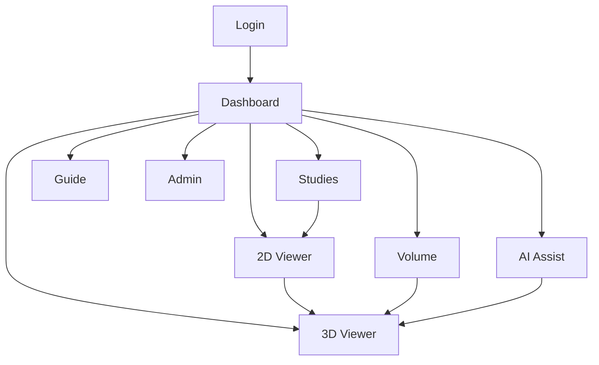

# AIDLC-MRI 화면설계서

## 1. 문서 개요

본 문서는 AIDLC-MRI 웹 서비스의 주요 화면 구성을 정리한 화면설계서이다.  
서비스는 로컬 DICOM MRI volume을 불러와 2D slice, brain mask overlay, brain-only 3D mesh, volume tracking, pipeline 상태를 확인하는 연구/포트폴리오용 MVP 화면으로 구성된다.

> Viewer only. Not for diagnosis. 최종 의료 판단은 반드시 전문 의료진의 판독을 따라야 한다.

## 2. 서비스 구조

| 구분 | 화면 | 주요 목적 |
|---|---|---|
| 인증 | Login | 관리자 또는 생성된 사용자 계정으로 로그인 |
| 메인 | Dashboard | 전체 서비스 현황과 주요 기능 진입 |
| 데이터 | Studies | DICOM series 목록 확인 |
| 영상 | 2D Viewer | MRI slice 및 brain mask overlay 확인 |
| 분석 | Volume | 현재 brain mask volume과 mock tracking 확인 |
| 3D | 3D Viewer | brain mask 기반 3D surface preview 확인 |
| 점검 | AI Assist | mask, mesh, overlay pipeline 상태 확인 |
| 안내 | Guide | 사용자 흐름과 기능 안내 |
| 관리 | Admin | 사용자 계정 생성 및 목록 확인 |

## 3. 공통 레이아웃

### 3.1 상단 내비게이션

대부분의 로그인 후 화면은 동일한 상단 내비게이션을 사용한다.

- 좌측: 서비스명 `AIDLC-MRI`
- 중앙: `Dashboard`, `Studies`, `2D Viewer`, `Volume`, `3D Viewer`, `AI Assist`, `Guide`, `Admin`
- 우측: 현재 사용자 `Administrator`, `Logout`
- 현재 위치 메뉴는 연한 파란색 배경으로 활성 표시

### 3.2 디자인 톤

- 배경: 연한 청록/회색 계열의 차분한 의료·연구용 화면
- 카드: 흰색 배경, 얇은 테두리, 낮은 radius
- 주요 버튼: 진한 파란색
- 보조 버튼: 연한 회색/파란색
- 상태 강조: `ON`, `OFF`, `OK`, `Needs attention` 등 짧은 텍스트로 표시

## 4. 화면별 설계

## 4.1 Login

### 화면 목적

사용자가 AIDLC-MRI viewer에 접근하기 전 계정 인증을 수행한다.  
관리자가 생성한 계정만 사용할 수 있으며, 기본 관리자 계정 안내를 함께 제공한다.

### 주요 구성

| 영역 | 구성요소 | 설명 |
|---|---|---|
| 로그인 카드 | Secure Access badge | 보안 접근 화면임을 표시 |
| 제목 | AIDLC-MRI Login | 서비스 로그인 화면 제목 |
| 입력 | Username | 사용자 아이디 입력 |
| 입력 | Password | 비밀번호 입력 |
| 버튼 | Login | 로그인 실행 |
| 안내 | Default admin | 기본 관리자 계정 정보 표시 |

### 동작

- `Username`, `Password` 입력 후 `Login` 버튼 클릭
- 인증 성공 시 `Dashboard`로 이동
- 인증 실패 시 오류 메시지 표시 필요

## 4.2 Dashboard

### 화면 목적

서비스의 현재 로드 상태와 주요 기능 진입점을 한 화면에서 제공한다.

### 주요 구성

| 영역 | 구성요소 | 설명 |
|---|---|---|
| Hero 카드 | Brain MRI 2D/3D Visualization Web Service | 서비스 핵심 설명 |
| 액션 버튼 | Studies 보기 | DICOM series 목록으로 이동 |
| 액션 버튼 | 2D Viewer 열기 | 2D MRI slice viewer로 이동 |
| 액션 버튼 | Volume 보기 | volume tracking 화면으로 이동 |
| 액션 버튼 | 3D Viewer 열기 | 3D preview 화면으로 이동 |
| 상태 카드 | 현재 로드 상태 | Loaded, Series, Mesh 상태 요약 |
| 기능 카드 | DICOM Series List | Studies 기능 설명 |
| 기능 카드 | MRI Slice Viewer | 2D Viewer 기능 설명 |
| 기능 카드 | Tracking Summary | Volume 기능 설명 |
| 기능 카드 | Brain Mask Surface | 3D Viewer 기능 설명 |
| 기능 카드 | Mask Pipeline Status | AI Assist 기능 설명 |

### 표시 데이터

- Source: `DICOM`
- Shape: `176 x 256 x 256`
- Spacing: `1.00 / 0.98 / 0.98`
- Series: `t1_mpr_SAG_3D_1mm`
- Loaded 상태: `ON`
- Series 수: `98`
- Mesh 상태: `OFF`

## 4.3 Studies

### 화면 목적

로컬 MRI data 폴더의 DICOM series를 study 형태의 행 목록으로 보여준다.  
사용자는 각 series의 파일 수, shape, 준비 상태를 확인하고 2D Viewer로 이동할 수 있다.

### 주요 구성

| 영역 | 구성요소 | 설명 |
|---|---|---|
| 상단 카드 | DICOM series list | 화면 제목 및 설명 |
| 버튼 | Refresh studies | series 목록 새로고침 |
| 버튼 | Open 2D Viewer | 2D Viewer로 이동 |
| 테이블 | Study | `BRAIN_T01` 형식의 study label |
| 테이블 | Section | 예: Brain MRI |
| 테이블 | Description | DICOM series description |
| 테이블 | Files | 파일 개수 |
| 테이블 | Shape | image matrix 크기 |
| 테이블 | Status | 준비 상태 |

### 동작

- `Refresh studies` 클릭 시 로컬 DICOM series 목록 재스캔
- `Open 2D Viewer` 클릭 시 선택 또는 기본 series를 viewer에서 확인
- 테이블은 많은 행을 보여줄 수 있으므로 세로 스크롤을 고려

## 4.4 2D Viewer

### 화면 목적

DICOM volume을 불러와 sagittal, axial, coronal plane별 MRI slice를 확인하고 brain mask overlay를 켜서 mask 영역을 검토한다.

### 주요 구성

| 영역 | 구성요소 | 설명 |
|---|---|---|
| 좌측 패널 | DICOM series select | 표시할 series 선택 |
| 좌측 패널 | Load volume | 선택한 volume 로드 |
| 좌측 패널 | Slice plane | sagittal, axial, coronal 선택 |
| 좌측 패널 | Slice index slider/input | slice 위치 조절 |
| 좌측 패널 | Mask overlay | overlay on/off 선택 |
| 좌측 패널 | Overlay type | brain mask 등 overlay 종류 선택 |
| 좌측 패널 | Region | cerebrum 등 region 선택 |
| 좌측 패널 | Refresh slice | 현재 설정으로 slice 갱신 |
| 좌측 패널 | Generate/check brain mask | brain mask 생성 또는 확인 |
| 본문 | Sagittal slice | MRI grayscale 이미지 표시 |
| 본문 | Mask overlay | 노란색 반투명 mask 표시 |
| 우측 상단 | Open 3D | 3D Viewer로 이동 |

### 표시 데이터

- Source: `DICOM`
- Shape: `176 x 256 x 256`
- Spacing: `1.00 / 0.98 / 0.98`
- Series: `t1_mpr_SAG_3D_1mm`
- Mask source: `fallback_threshold`
- Mask checked 상태와 mask ratio 표시

### 동작

- plane 변경 시 해당 방향의 slice로 전환
- slider 이동 시 slice index가 변경되고 이미지 갱신
- mask overlay가 `on`이면 MRI 위에 brain mask를 반투명 색상으로 표시
- `Generate/check brain mask` 클릭 시 mask 생성 가능 여부와 상태를 확인

## 4.5 Volume

### 화면 목적

현재 brain mask의 voxel count와 volume 값을 요약하고, T01~T14 mock longitudinal tracking 값을 그래프와 테이블로 보여준다.

### 주요 구성

| 영역 | 구성요소 | 설명 |
|---|---|---|
| 상단 카드 | Brain MRI volume summary | volume tracking 화면 소개 |
| 버튼 | Refresh volume | 현재 mask 기준 volume 재계산 |
| 버튼 | Open 3D | 3D Viewer로 이동 |
| 요약 카드 | Current brain mask | voxel, mm3, ml, formula 표시 |
| 그래프 | Mock longitudinal tracking | T01~T14 volume bar 표시 |
| 테이블 | Study | tracking study label |
| 테이블 | Volume cm3 | volume 값 |
| 테이블 | Change cm3 | 이전 값 대비 변화량 |
| 테이블 | Change % | 변화율 |
| 테이블 | Note | baseline 또는 tracking 메모 |

### 표시 데이터 예시

- Voxels: `1,897,709`
- mm3: `1,809,796.33 mm3`
- ml: `1809.796 ml`
- Formula: `voxel_count * spacing_z_mm * spacing_y_mm * spacing_x_mm`

## 4.6 3D Viewer

### 화면 목적

brain mask를 기반으로 생성된 3D surface mesh를 미리 확인한다.  
최종 brain-only 3D는 SynthStrip, HD-BET 또는 cached brain mask가 유효할 때만 활성화된다.

### 주요 구성

| 영역 | 구성요소 | 설명 |
|---|---|---|
| 좌측 패널 | DICOM series | 3D preview 대상 series 선택 |
| 좌측 패널 | Load volume | volume 로드 |
| 좌측 패널 | Preview slice | 2D preview 이미지 |
| 좌측 패널 | Slice slider | preview slice index 조절 |
| 좌측 패널 | Plane | sagittal 등 plane 선택 |
| 좌측 패널 | Mask overlay | overlay on/off |
| 좌측 패널 | Gaussian sigma | smoothing 파라미터 |
| 좌측 패널 | Smoothing iterations | mesh smoothing 반복 수 |
| 좌측 패널 | Downsample | mesh downsample 값 |
| 좌측 버튼 | Generate/check brain mask | mask 생성/확인 |
| 좌측 버튼 | Rebuild mask | mask 재생성 |
| 좌측 버튼 | Clear outputs | 생성 결과 정리 |
| 좌측 버튼 | Run HD-BET | HD-BET 실행 |
| 좌측 버튼 | Generate Preview 3D from Debug Mask | debug mask 기반 preview 3D 생성 |
| 좌측 버튼 | Generate Final 3D | 최종 3D 생성 |
| 우측 영역 | 3D canvas | brain surface mesh 표시 |

### 주의 문구

- `Preview only / Not for diagnosis`
- debug mask only는 진단용이 아니며 final brain-only 3D에는 SynthStrip 또는 HD-BET 결과가 필요

## 4.7 AI Assist

### 화면 목적

skull stripping, mask, mesh, overlay 준비 상태를 한 화면에서 점검한다.  
문제가 있는 pipeline 단계를 `Needs attention`으로 표시해 사용자가 다음 조치를 결정할 수 있게 한다.

### 주요 구성

| 영역 | 구성요소 | 설명 |
|---|---|---|
| 상단 카드 | Brain mask pipeline status | pipeline 상태 요약 |
| 버튼 | Refresh status | 상태 새로고침 |
| 버튼 | Check overlay | overlay 가능 여부 확인 |
| 버튼 | Open 3D | 3D Viewer로 이동 |
| 체크 카드 | Pipeline checks | 항목별 상태 표시 |
| 요약 카드 | Result summary | engine, mask, mesh, shape 표시 |

### Pipeline checks

| 항목 | 상태 |
|---|---|
| Brain mask available | OK |
| Stable mesh exported | Needs attention |
| Region label map available | Needs attention |
| 2D overlay supported | Needs attention |
| Diagnostic claim blocked | OK |

### Result summary

- Engine: `HD-BET / skull-stripping assisted viewer`
- Mask: `not available`
- Mesh: `not generated`
- Shape: `176 x 256 x 256`

## 4.8 Guide

### 화면 목적

로그인한 사용자가 MRI viewer의 전체 흐름을 빠르게 이해할 수 있도록 단계별 사용법을 제공한다.

### 안내 단계

| 단계 | 제목 | 설명 |
|---|---|---|
| 1 | 로그인과 계정 | 관리자가 만든 계정으로 접속 |
| 2 | Studies | DICOM series 확인 후 viewer에서 로드 |
| 3 | 2D Viewer | plane별 MRI slice와 mask overlay 확인 |
| 4 | 3D Viewer | 유효한 brain mask가 있을 때 3D surface mesh 생성/미리보기 |
| 5 | Volume | brain mask volume 요약과 mock tracking 확인 |
| 6 | AI Assist | mask, mesh, overlay 준비 상태 점검 |

### 동작

- 각 카드의 버튼을 클릭하면 해당 기능 화면으로 이동
- 설명 화면에서도 진단용이 아니라는 안내 문구를 유지

## 4.9 Admin

### 화면 목적

관리자가 사용자 계정을 생성하고, 기존 사용자 목록을 확인한다.

### 주요 구성

| 영역 | 구성요소 | 설명 |
|---|---|---|
| 상단 카드 | User management | 관리자 전용 사용자 관리 안내 |
| Create user | Username | 신규 사용자 아이디 |
| Create user | Display name | 표시 이름 |
| Create user | Role | User/Admin 등 권한 선택 |
| Create user | Temporary password | 임시 비밀번호 |
| Create user | Create account | 계정 생성 실행 |
| Users | Username | 사용자 아이디 |
| Users | Name | 표시 이름 |
| Users | Role | 권한 |
| Users | Created | 생성일 |

### 동작

- 관리자만 접근 가능
- 신규 사용자 정보를 입력하고 `Create account` 클릭 시 계정 생성
- 생성된 계정은 우측 Users 테이블에 표시

## 5. 사용자 흐름

## 6. 화면 요구사항 요약

| ID | 요구사항 | 우선순위 |
|---|---|---|
| UI-001 | 로그인 전에는 viewer 주요 화면에 접근할 수 없어야 한다. | High |
| UI-002 | 상단 내비게이션은 현재 화면을 명확하게 표시해야 한다. | High |
| UI-003 | DICOM series는 study, description, files, shape, status 기준으로 표시해야 한다. | High |
| UI-004 | 2D Viewer는 plane, slice index, mask overlay를 조절할 수 있어야 한다. | High |
| UI-005 | Volume 화면은 voxel, mm3, ml 계산 결과를 표시해야 한다. | Medium |
| UI-006 | 3D Viewer는 preview와 final 3D 생성 상태를 구분해야 한다. | High |
| UI-007 | AI Assist는 pipeline 상태를 OK와 Needs attention으로 구분해야 한다. | Medium |
| UI-008 | 모든 의료 관련 화면에는 진단용이 아니라는 문구를 표시해야 한다. | High |
| UI-009 | Admin 화면은 관리자 계정에서만 접근 가능해야 한다. | High |

## 7. 비고

- 본 화면설계서는 제공된 캡처 이미지를 기준으로 작성했다.
- 화면 내 수치와 series 이름은 데모/포트폴리오용 예시 데이터로 보인다.
- 실제 의료 서비스로 확장할 경우 인증, 개인정보 보호, 감사 로그, 데이터 익명화, 의료기기 규제 검토가 별도로 필요하다.
